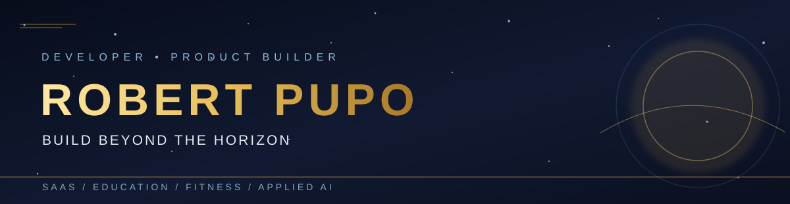
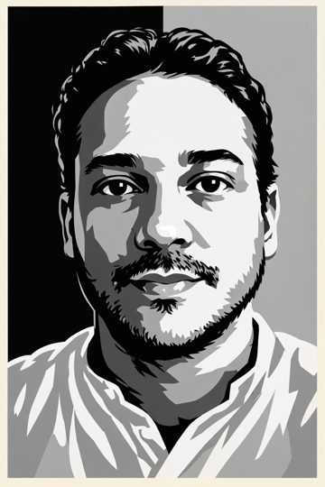
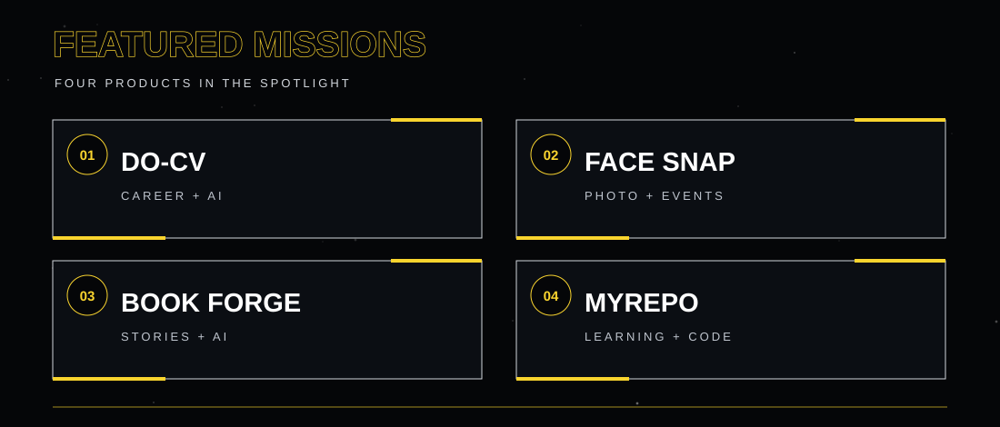

 

# Robert Pupo

### Full Stack Developer · Product Builder · AI Engineer

**I turn real problems into digital products, automation, and software running in production.**

[Português](README.md) · **English** · [Español](README.es.md)

Santos, Brazil · SaaS · Education · Fitness · Applied AI

---

I'm a full stack developer and product builder. I work from problem discovery to architecture, interfaces, APIs, integrations, and operations. I also teach technology and programming, bringing software engineering into education.

**Core stack:** TypeScript · React · Next.js · Node.js · PostgreSQL · Prisma · Supabase · Tailwind CSS · REST APIs  
**Also working with:** NestJS · Docker · AWS/GCP · automation · LLMs and AI agents

## My product universe

## Featured products

| Product | What it does | Explore |
| :--- | :--- | :--- |
| **ProSystem** | Education management across students, classes, attendance, staff, and reporting. | [Product](https://prosystemapp.online/) |
| **Meu Treino** | Connects students, trainers, and fitness facilities through training plans, exercises, health intake, follow-up, and community. | [Product](https://www.mtreino.online/) |
| **Smart Store** | Organizes workspaces, projects, and files for content and automation workflows. | [Product](https://smartstore.base44.app/) |
| **Data Flow** | Structures research, evidence, and decisions for product work and experiments. | [Product](https://dataflow-decision-hub.base44.app/) |
| **Automation Engine** | Orchestrates workflows across the Creator B.OS ecosystem. | In development |
| **InfoSuite** | Digital literacy platform with learning games, lesson plans, and progress tracking. | In development |

> Some products have private source code. Public links point to their product pages where available; access may require sign-in.

## More projects

<strong>Education and social impact</strong>

- **Jovens Tech:** practical web programming and UI/UX education for young people.
- **TI para Todos INJR:** digital presence for local businesses through student-led applied learning.
- **App Alunos INJR / App INJR API / Alunos Manager:** student management applications and services.
- **Mundo do Conhecimento:** [public repository](https://github.com/RobertPupoFStack/mundo-do-conhecimento).
- **Super Talentos, EduHeroes, Casa Lootus Connect:** digital initiatives for education and social impact.
- **ProSystem Colégios / SPG ProSystem:** education management initiatives.

<strong>AI, productivity, and platforms</strong>

- **Book Forge:** AI-assisted book creation.
- **Do CV / Do CV AI:** résumé and career workflow products.
- **AI Creative Studio, Easy AI, Nexus AgentHub:** AI creation and agent experiments.
- **EasyForms:** digital forms.
- **LicitaAI:** AI application for procurement workflows.
- **Creator B.OS:** ecosystem connecting research, decisions, storage, automation, and content distribution.

<strong>Products and experiments</strong>

- **Conquer Quiz, Memory Master, Quiz IO:** quiz and learning experiences.
- **FaceSnap:** visual experience project.
- **Retain CRM, Radar de Leads Físico:** relationship and prospecting tools.
- **Clube Local, Astrum Signa, Venda:** product experiments.
- **ExtremeOdds:** [public repository](https://github.com/RobertPupoFStack/ExtremeOdds).
- **Sorteador Bingo:** [public repository](https://github.com/RobertPupoFStack/sorteadorBingo).

<strong>Public projects and teaching materials</strong>

[Tarefa Hamburgueria](https://github.com/RobertPupoFStack/tarefa-hambugueria) · [Primeira aula CSS](https://github.com/RobertPupoFStack/primeiraAulaCSS) · [Contador Next](https://github.com/RobertPupoFStack/contador-next) · [All public repositories](https://github.com/RobertPupoFStack?tab=repositories)

## How I build

`Problem → research → prototype → implementation → integration → metrics → iteration`

I combine product thinking, engineering, and automation to deliver useful software. I'm interested in **SaaS, AI agents, developer tools, and education technology**.

**Let's connect:** [LinkedIn](https://www.linkedin.com/in/robertpupo/) · [Email](mailto:robertdevfullstack@gmail.com)
